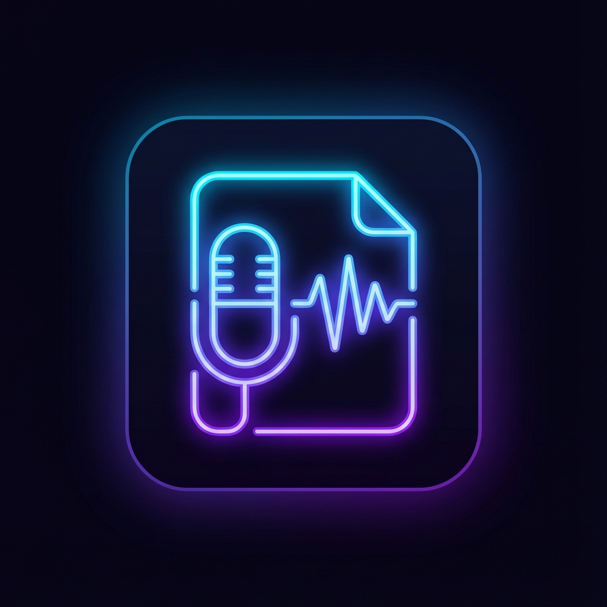

<!-- Improved compatibility of back to top link: See: https://github.com/othneildrew/Best-README-Template/pull/73 -->
<a id="readme-top"></a>

<!-- PROJECT SHIELDS -->
[![Contributors][contributors-shield]][contributors-url]
[![Forks][forks-shield]][forks-url]
[![Stargazers][stars-shield]][stars-url]
[![Issues][issues-shield]][issues-url]
[![MIT License][license-shield]][license-url]

<!-- PROJECT LOGO -->
<br />
<div align="center">
  <a href="https://github.com/realmorita/voice-log">
    
  </a>

  <h3 align="center">Voice Log</h3>

  <p align="center">
    ローカル音声文字起こし＋LLM要約ツール
    <br />
    <a href="#getting-started"><strong>セットアップはこちら »</strong></a>
    <br />
    <br />
    <!-- <a href="https://github.com/realmorita/voice-log">View Demo</a>
    &middot; -->
    <a href="https://github.com/realmorita/voice-log/issues/new?labels=bug&template=bug_report.md">不具合を報告</a>
    &middot;
    <a href="https://github.com/realmorita/voice-log/issues/new?labels=enhancement&template=feature_request.md">機能要望</a>
  </p>
</div>

<!-- TABLE OF CONTENTS -->
<details>
  <summary>目次</summary>
  <ol>
    <li>
      <a href="#about-the-project">プロジェクトについて</a>
      <ul>
        <li><a href="#built-with">使用技術</a></li>
      </ul>
    </li>
    <li>
      <a href="#getting-started">セットアップ</a>
      <ul>
        <li><a href="#prerequisites">前提条件</a></li>
        <li><a href="#installation">インストール</a></li>
      </ul>
    </li>
    <li><a href="#usage">使い方</a></li>
    <li><a href="#roadmap">ロードマップ</a></li>
    <li><a href="#contributing">コントリビュート</a></li>
    <li><a href="#license">ライセンス</a></li>
    <li><a href="#contact">連絡先</a></li>
  </ol>
</details>

<!-- ABOUT THE PROJECT -->
<a id="about-the-project"></a>
## プロジェクトについて

[![Voice Log Banner][product-screenshot]](https://github.com/realmorita/voice-log)

**Voice Log** は、ローカル環境だけで完結する「音声の文字起こし＋LLM要約」ツールです。

会議・ボイスメモ・音声ファイルを文字起こししつつ、音声やテキストを外部へ送信せずに処理できます。文字起こしは **Faster Whisper**、要約は **Ollama** を使い、プライバシーを保ったまま高品質に扱えることを目指しています。

主な機能:
*   **プライバシー重視**: すべてローカル処理。音声やテキストを外部サーバへ送信しません。
*   **高精度な文字起こし**: [Faster Whisper](https://github.com/SYSTRAN/faster-whisper) による音声認識。
*   **LLM要約**: Ollama 経由でローカルLLMを使い、議事録・要約を生成します。
*   **長時間音声対応**: メモリ使用量を抑えつつ長い録音も処理できます。
*   **ハルシネーション抑制**: Whisperの反復的な誤出力を検出してトリミングします。

<p align="right">(<a href="#readme-top">トップへ戻る</a>)</p>

<a id="built-with"></a>
### 使用技術

* [![Python][Python.org]][Python-url]
* [![Faster Whisper][FasterWhisper]][FasterWhisper-url]
* [![Ollama][Ollama]][Ollama-url]
* [![Rich][Rich]][Rich-url]
* [![UV][UV]][UV-url]

<p align="right">(<a href="#readme-top">トップへ戻る</a>)</p>

<!-- GETTING STARTED -->
<a id="getting-started"></a>
## セットアップ

ローカルで動かすための手順です。

<a id="prerequisites"></a>
### 前提条件

*   **OS**: Linux（推奨）、Windows（WSL2）、macOS
*   **Python**: 3.12 以上
*   **GPU**: NVIDIA GPU（CUDA 12.x / 13.x）。CPUでも動作しますが低速です。
*   **Ollama**: 要約機能に必要です。
    *   [ollama.com](https://ollama.com/) からインストール
    *   モデルを取得（例: `gpt-oss:20b`）
        ```sh
        ollama pull gpt-oss:20b
        ```

<a id="installation"></a>
### インストール

本プロジェクトはパッケージ管理に `uv` を使います。

1.  リポジトリを取得
    ```sh
    git clone https://github.com/realmorita/voice-log.git
    cd voice-log
    ```
2.  依存関係をインストール
    ```sh
    uv sync
    ```
3.  （任意）設定
    すぐに設定を調整したい場合は `config.yaml` を作成してください。未作成でも、アプリ実行時にデフォルトを生成できます。

---

### DGX Spark（aarch64 / CUDA 13）専用: CTranslate2 GPU（cuDNN）wheel を作って uv 環境へ導入する

このリポジトリの `pyproject.toml` には、DGX Spark（ARM/aarch64 + CUDA 13）環境でビルドした `ctranslate2` wheel を固定するために、以下のような **ローカルwheel指定**を入れています。

**もし DGX Spark（aarch64 / CUDA 13）環境ではない場合は、必ず `pyproject.toml` の `[tool.uv.sources]` から `ctranslate2 = { path = "..." }` を削除**してください（そのままだと他環境では `uv sync` で解決不能になります）。

例:

```toml
[tool.uv.sources]
ctranslate2 = { path = "../_build/CTranslate2/python/dist/ctranslate2-4.6.2-cp312-cp312-linux_aarch64.whl" }
```

削除した場合は、lock を更新してから同期します:

```sh
uv lock
uv sync
```

#### 1. 目的

DGX Spark（ARM/aarch64）上の CUDA 13 環境で、faster-whisper 等が利用する CTranslate2 を GPU（CUDA）+ cuDNN 対応でビルドし、wheel として再利用可能にする。

`uv run` / `uv sync` による依存同期で CPU 版に巻き戻されないように、ローカル wheel をプロジェクト依存として固定する。

#### 2. 前提条件

##### 2.1 環境要件

- OS: Ubuntu（DGX OS）
- アーキテクチャ: aarch64
- CUDA Toolkit: 13.x（`nvcc --version` が 13.0 など）
- Python: 3.12 系推奨（例：`/usr/bin/python3.12`）
- `uv` が利用可能

確認:

```sh
uname -m
nvcc --version
python3 --version
uv --version
```

#### 3. ディレクトリ設計（推奨）

- ビルド作業用（捨てやすい）: `~/dev/_build/CTranslate2/`
- 実行プロジェクト（例：voice-log）: `~/dev/voice-log/`（この中の `.venv` に最終導入）

#### 4. 依存パッケージのインストール

##### 4.1 ビルドツール類

```sh
sudo apt-get update
sudo apt-get install -y \
  git cmake ninja-build build-essential \
  python3-dev patchelf
```

##### 4.2 OpenBLAS（ARM で MKL を使わない前提）

```sh
sudo apt-get install -y libopenblas-dev
```

##### 4.3 cuDNN（CUDA 13 用）

DGX Spark の apt リポジトリに CUDA 13 用 cuDNN があることを確認:

```sh
apt-cache search cudnn | head -n 50
```

インストール（CUDA 13 用 runtime + headers + dev）:

```sh
sudo apt-get install -y \
  libcudnn9-cuda-13 \
  libcudnn9-dev-cuda-13 \
  libcudnn9-headers-cuda-13
```

必要に応じて JIT 版も導入（推奨）:

```sh
sudo apt-get install -y \
  libcudnn9-jit-cuda-13 \
  libcudnn9-jit-dev-cuda-13
```

導入確認:

```sh
ldconfig -p | grep -i cudnn | head
sudo find /usr -name cudnn.h -o -name cudnn_version.h 2>/dev/null | head
```

#### 5. CTranslate2 の取得

```sh
mkdir -p ~/dev/_build
cd ~/dev/_build
git clone --recursive https://github.com/OpenNMT/CTranslate2.git
cd CTranslate2
```

#### 6. uv のビルド用 venv を作る（ビルド依存を隔離）

```sh
cd ~/dev/_build/CTranslate2
uv venv -p /usr/bin/python3.12 .venv-build
source .venv-build/bin/activate
```

Python ビルド依存を導入:

```sh
cd python
uv pip install -U pip setuptools wheel
uv pip install -r install_requirements.txt
cd ..
```

補足: `python setup.py bdist_wheel` は **必ず `.venv-build` 上で実行**する。実行プロジェクトの venv（例：`voice-log/.venv`）で実行すると pybind11 不足等で失敗しやすい。

#### 7. CTranslate2（C++ / CUDA / cuDNN）をビルド＆インストール

##### 7.1 CMake configure（OpenMP=COMP / MKL=OFF / OpenBLAS=ON）

```sh
cd ~/dev/_build/CTranslate2
rm -rf build

cmake -S . -B build -G Ninja \
  -DCMAKE_BUILD_TYPE=Release \
  -DWITH_CUDA=ON \
  -DWITH_CUDNN=ON \
  -DCUDA_DYNAMIC_LOADING=ON \
  -DOPENMP_RUNTIME=COMP \
  -DWITH_MKL=OFF \
  -DWITH_OPENBLAS=ON \
  -DCMAKE_INSTALL_PREFIX=/usr/local
```

ビルド:

```sh
cmake --build build -j"$(nproc)"
```

インストール:

```sh
sudo cmake --install build
sudo ldconfig
```

###### 7.1.1 よくある罠: Intel OpenMP（libiomp5）要求

エラー例: `Intel OpenMP runtime libiomp5 not found`

対処: `-DOPENMP_RUNTIME=COMP` を必ず指定（GCC の `libgomp` を使う）

###### 7.1.2 よくある罠: cuDNN include が見つからない

エラー例: `cuDNN include directory not found`

対処:

- cuDNN dev/headers を入れているか確認（前章）
- まだ見つからない場合、ヘッダ・ライブラリ位置を調べる

```sh
sudo find /usr -name cudnn.h -o -name cudnn_version.h 2>/dev/null | head -n 20
ldconfig -p | grep -i libcudnn | head -n 20
```

CMake に明示（例。実パスに置換）:

```sh
cmake -S . -B build -G Ninja \
  ... \
  -DCUDNN_INCLUDE_DIR=/usr/include \
  -DCUDNN_LIBRARY=/usr/lib/aarch64-linux-gnu/libcudnn.so
```

#### 8. wheel を生成（`/usr/local` を参照させるのが重要）

C++ 側を `/usr/local` に入れた上で、Python wheel を作る。

```sh
cd ~/dev/_build/CTranslate2
source .venv-build/bin/activate

cd python
rm -rf build dist *.egg-info

export CTRANSLATE2_ROOT=/usr/local
python setup.py bdist_wheel

ls -lh dist/
```

生成物例: `ctranslate2-4.6.2-cp312-cp312-linux_aarch64.whl`

#### 9. プロジェクト（例: voice-log）の uv venv にインストール

##### 9.1 プロジェクト venv を有効化

```sh
cd ~/dev/voice-log
source .venv/bin/activate
```

##### 9.2 既存の ctranslate2 を削除

注意: `uv pip uninstall` は `-y` をサポートしない

```sh
uv pip uninstall ctranslate2
```

##### 9.3 生成した wheel をインストール

```sh
uv pip install ~/dev/_build/CTranslate2/python/dist/*.whl
```

確認:

```sh
python -c "import ctranslate2; print(ctranslate2.__version__)"
```

#### 10. uv sync / uv run で「CPU 版に巻き戻される」問題の恒久対策（必須）

`uv run` はデフォルトで依存同期（sync）を行い、lock に基づいて別の `ctranslate2` に差し替えることがある。

対策は、ローカル wheel を **プロジェクト依存として固定**すること。

##### 10.1 一時回避（切り分け用）

```sh
uv run --no-sync main.py
```

##### 10.2 恒久対策: file 依存として追加して lock に固定

```sh
cd ~/dev/voice-log
source .venv/bin/activate

uv add "ctranslate2 @ file://$HOME/dev/_build/CTranslate2/python/dist/ctranslate2-4.6.2-cp312-cp312-linux_aarch64.whl"
uv lock
uv sync
```

以降は通常の `uv run main.py` で OK。

#### 11. 動作確認（Whisper の GPU 推論）

cuDNN が統合されていないと、Whisper の Conv1D で以下が出る:

`Conv1D on GPU currently requires the cuDNN library which is not integrated in this build`

本手順では `WITH_CUDNN=ON` + cuDNN導入済みのため、解消される想定。

```sh
uv run main.py
```

#### 12. トラブルシューティング

##### 12.1 `This CTranslate2 package was not compiled with CUDA support`

原因の代表例:

- `uv run` が sync で CPU 版へ巻き戻している
  - `uv run --no-sync ...` で回避できるならこれ
  - 恒久対策: `uv add "ctranslate2 @ file://..."` で固定
- wheel が `/usr/local` を参照せず CPU ビルド相当になっている
  - `CTRANSLATE2_ROOT=/usr/local` を付けて wheel を作り直す（第8章）

##### 12.2 `Conv1D on GPU ... cuDNN ... not integrated`

- `WITH_CUDNN=OFF` でビルドしている
- cuDNN の dev/headers が未導入、または CMake が検出できていない

対処: 第4.3 / 第7章の手順で cuDNN 導入 + `WITH_CUDNN=ON`

##### 12.3 `uv pip uninstall -y` がエラー

`uv pip uninstall` は `-y` 非対応。

`uv pip uninstall ctranslate2` を実行して対話で `y` を入力する。

#### 13. 再利用ガイド（他環境へ wheel を持っていく場合）

- 同一 OS / aarch64 / Python ABI（cp312）であれば wheel は再利用可能
- ただし実行側に CUDA 13 と cuDNN（CUDA 13 用）が存在することが前提

共有場所例: `~/wheelhouse/ctranslate2/ctranslate2-4.6.2-cp312-cp312-linux_aarch64.whl`

uv プロジェクトへは `uv add "ctranslate2 @ file://..."` が最も確実

<p align="right">(<a href="#readme-top">トップへ戻る</a>)</p>

<!-- USAGE EXAMPLES -->
<a id="usage"></a>
## 使い方

メインアプリを起動します:

```sh
uv run main.py
```

対話メニューが表示されます:

1.  **Record & Transcribe**: マイク録音を開始します。Enter で停止します。
2.  **File Transcribe**: 既存の音声ファイル（`.wav`, `.mp3`, `.m4a`, `.flac`）を処理します。
3.  **Text Summary**: 入力したテキストを要約します。
4.  **List Devices**: 利用可能な音声入力デバイスを表示します。
5.  **Settings**: プロンプトモードやLLMモデルを変更します。

より詳しい設定は `config.sample.yaml` または生成された `config.yaml` を参照してください。

<p align="right">(<a href="#readme-top">トップへ戻る</a>)</p>

<!-- ROADMAP -->
<a id="roadmap"></a>
## ロードマップ

- [x] 文字起こし（Faster Whisper）
- [x] ローカルLLM要約（Ollama）
- [x] VAD とハルシネーション検出
- [x] CLI / TUI
- [ ] リアルタイム文字起こし
- [ ] GUI（Web または Desktop）
- [ ] 話者分離（Diarization）

提案機能や既知の課題は [Issues](https://github.com/realmorita/voice-log/issues) を参照してください。

<p align="right">(<a href="#readme-top">トップへ戻る</a>)</p>

<!-- CONTRIBUTING -->
<a id="contributing"></a>
## コントリビュート

コントリビュートは歓迎です。改善案があれば Issue を立てるか、PR を送ってください。

やり方が分からない場合でも、まずは Issue で相談してもらえれば大丈夫です。

1.  リポジトリをFork
2.  ブランチを作成（例: `git checkout -b feature/AmazingFeature`）
3.  変更をコミット
4.  ブランチをPush
5.  Pull Request を作成

<p align="right">(<a href="#readme-top">トップへ戻る</a>)</p>

<!-- LICENSE -->
<a id="license"></a>
## ライセンス

MIT License のもとで配布しています。詳細は `LICENSE.txt` を参照してください。

<p align="right">(<a href="#readme-top">トップへ戻る</a>)</p>

<!-- CONTACT -->
<a id="contact"></a>
## 連絡先

Morita - [@realmorita](https://github.com/realmorita)

プロジェクト: [https://github.com/realmorita/voice-log](https://github.com/realmorita/voice-log)

<p align="right">(<a href="#readme-top">トップへ戻る</a>)</p>

<!-- MARKDOWN LINKS & IMAGES -->
<!-- https://www.markdownguide.org/basic-syntax/#reference-style-links -->
[contributors-shield]: https://img.shields.io/github/contributors/realmorita/voice-log.svg?style=for-the-badge
[contributors-url]: https://github.com/realmorita/voice-log/graphs/contributors
[forks-shield]: https://img.shields.io/github/forks/realmorita/voice-log.svg?style=for-the-badge
[forks-url]: https://github.com/realmorita/voice-log/network/members
[stars-shield]: https://img.shields.io/github/stars/realmorita/voice-log.svg?style=for-the-badge
[stars-url]: https://github.com/realmorita/voice-log/stargazers
[issues-shield]: https://img.shields.io/github/issues/realmorita/voice-log.svg?style=for-the-badge
[issues-url]: https://github.com/realmorita/voice-log/issues
[license-shield]: https://img.shields.io/github/license/realmorita/voice-log.svg?style=for-the-badge
[license-url]: https://github.com/realmorita/voice-log/blob/main/LICENSE.txt
[product-screenshot]: .github/assets/banner.png
[Python.org]: https://img.shields.io/badge/Python-3776AB?style=for-the-badge&logo=python&logoColor=white
[Python-url]: https://python.org
[FasterWhisper]: https://img.shields.io/badge/Faster_Whisper-000000?style=for-the-badge&logo=openai&logoColor=white
[FasterWhisper-url]: https://github.com/SYSTRAN/faster-whisper
[Ollama]: https://img.shields.io/badge/Ollama-FFFFFF?style=for-the-badge&logo=ollama&logoColor=black
[Ollama-url]: https://ollama.com/
[Rich]: https://img.shields.io/badge/Rich-D70015?style=for-the-badge&logo=pypi&logoColor=white
[Rich-url]: https://github.com/Textualize/rich
[UV]: https://img.shields.io/badge/UV-DB61A2?style=for-the-badge&logo=python&logoColor=white
[UV-url]: https://github.com/astral-sh/uv