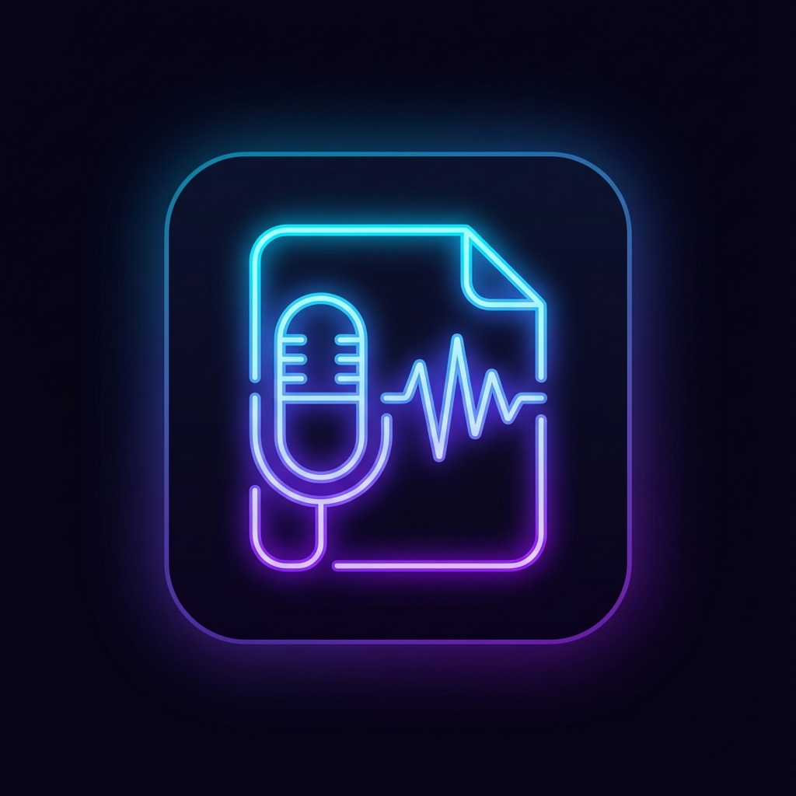

<!-- Improved compatibility of back to top link: See: https://github.com/othneildrew/Best-README-Template/pull/73 -->
<a id="readme-top"></a>

<!-- PROJECT SHIELDS -->
[![Contributors][contributors-shield]][contributors-url]
[![Forks][forks-shield]][forks-url]
[![Stargazers][stars-shield]][stars-url]
[![Issues][issues-shield]][issues-url]
[![MIT License][license-shield]][license-url]

<!-- PROJECT LOGO -->
<br />
<div align="center">
  <a href="https://github.com/realmorita/voice-log">
    
  </a>

  <h3 align="center">Voice Log</h3>

  <p align="center">
    Local Voice Transcription & LLM Summarization Tool
    <br />
    <a href="#getting-started"><strong>Explore the docs »</strong></a>
    <br />
    <br />
    <!-- <a href="https://github.com/realmorita/voice-log">View Demo</a>
    &middot; -->
    <a href="https://github.com/realmorita/voice-log/issues/new?labels=bug&template=bug_report.md">Report Bug</a>
    &middot;
    <a href="https://github.com/realmorita/voice-log/issues/new?labels=enhancement&template=feature_request.md">Request Feature</a>
  </p>
</div>

<!-- TABLE OF CONTENTS -->
<details>
  <summary>Table of Contents</summary>
  <ol>
    <li>
      <a href="#about-the-project">About The Project</a>
      <ul>
        <li><a href="#built-with">Built With</a></li>
      </ul>
    </li>
    <li>
      <a href="#getting-started">Getting Started</a>
      <ul>
        <li><a href="#prerequisites">Prerequisites</a></li>
        <li><a href="#installation">Installation</a></li>
      </ul>
    </li>
    <li><a href="#usage">Usage</a></li>
    <li><a href="#roadmap">Roadmap</a></li>
    <li><a href="#contributing">Contributing</a></li>
    <li><a href="#license">License</a></li>
    <li><a href="#contact">Contact</a></li>
  </ol>
</details>

<!-- ABOUT THE PROJECT -->
## About The Project

[![Voice Log Banner][product-screenshot]](https://github.com/realmorita/voice-log)

**Voice Log** is a high-performance voice transcription and LLM summarization tool designed to run entirely in your local environment.

It allows you to transcribe meetings, voice notes, and audio files while ensuring privacy by keeping all data on your machine. Leveraging **Faster Whisper** for transcription and **Ollama** for summarization, it provides a powerful and secure solution for managing voice data.

Key Features:
*   **Privacy First**: All processing happens locally. No audio or text is sent to external servers.
*   **High Accuracy**: Powered by [Faster Whisper](https://github.com/SYSTRAN/faster-whisper) for state-of-the-art speech recognition.
*   **AI Summarization**: Automatically generates minutes and summaries using local LLMs via Ollama.
*   **Long-form Audio**: Efficient memory management allows processing of long recordings.
*   **Hallucination Control**: Automatically detects and trims Whisper's repetitive hallucinations.

<p align="right">(<a href="#readme-top">back to top</a>)</p>

### Built With

* [![Python][Python.org]][Python-url]
* [![Faster Whisper][FasterWhisper]][FasterWhisper-url]
* [![Ollama][Ollama]][Ollama-url]
* [![Rich][Rich]][Rich-url]
* [![UV][UV]][UV-url]

<p align="right">(<a href="#readme-top">back to top</a>)</p>

<!-- GETTING STARTED -->
## Getting Started

To get a local copy up and running follow these simple steps.

### Prerequisites

*   **OS**: Linux (Recommended), Windows (WSL2), macOS
*   **Python**: 3.12 or higher
*   **GPU**: NVIDIA GPU (CUDA 12.x recommended) for faster processing. CPU is supported but slower.
*   **Ollama**: Required for summarization features.
    *   Install from [ollama.com](https://ollama.com/)
    *   Pull a model (e.g., `qwen2.5:14b`):
        ```sh
        ollama pull qwen2.5:14b
        ```

### Installation

This project uses `uv` for package management.

1.  Clone the repo
    ```sh
    git clone https://github.com/realmorita/voice-log.git
    cd voice-log
    ```
2.  Install dependencies
    ```sh
    uv sync
    ```
3.  (Optional) Configuration
    Create a `config.yaml` file if you want to customize settings immediately, or simply run the app to generate a default one.

<p align="right">(<a href="#readme-top">back to top</a>)</p>

<!-- USAGE EXAMPLES -->
## Usage

Run the main application:

```sh
uv run main.py
```

You will see an interactive menu:

1.  **Record & Transcribe**: Start recording from your microphone. Press Enter to stop.
2.  **File Transcribe**: Process an existing audio file (`.wav`, `.mp3`, `.m4a`, `.flac`).
3.  **Text Summary**: Summarize manually entered text.
4.  **List Devices**: Check available audio input devices.
5.  **Settings**: Change prompt modes and LLM models.

_For more detailed configuration options, refer to `config.sample.yaml` or the generated `config.yaml`._

<p align="right">(<a href="#readme-top">back to top</a>)</p>

<!-- ROADMAP -->
## Roadmap

- [x] Core Transcription (Faster Whisper)
- [x] Local LLM Summarization (Ollama)
- [x] VAD & Hallucination Detection
- [x] CLI / TUI Interface
- [ ] Real-time Transcription Support
- [ ] GUI Interface (Web or Desktop)
- [ ] Speaker Diarization

See the [open issues](https://github.com/realmorita/voice-log/issues) for a full list of proposed features (and known issues).

<p align="right">(<a href="#readme-top">back to top</a>)</p>

<!-- CONTRIBUTING -->
## Contributing

Contributions are what make the open source community such an amazing place to learn, inspire, and create. Any contributions you make are **greatly appreciated**.

If you have a suggestion that would make this better, please fork the repo and create a pull request. You can also simply open an issue with the tag "enhancement".
Don't forget to give the project a star! Thanks again!

1.  Fork the Project
2.  Create your Feature Branch (`git checkout -b feature/AmazingFeature`)
3.  Commit your Changes (`git commit -m 'Add some AmazingFeature'`)
4.  Push to the Branch (`git push origin feature/AmazingFeature`)
5.  Open a Pull Request

<p align="right">(<a href="#readme-top">back to top</a>)</p>

<!-- LICENSE -->
## License

Distributed under the MIT License. See `LICENSE.txt` for more information.

<p align="right">(<a href="#readme-top">back to top</a>)</p>

<!-- CONTACT -->
## Contact

Your Name - [@realmorita](https://github.com/realmorita)

Project Link: [https://github.com/realmorita/voice-log](https://github.com/realmorita/voice-log)

<p align="right">(<a href="#readme-top">back to top</a>)</p>

<!-- MARKDOWN LINKS & IMAGES -->
<!-- https://www.markdownguide.org/basic-syntax/#reference-style-links -->
[contributors-shield]: https://img.shields.io/github/contributors/realmorita/voice-log.svg?style=for-the-badge
[contributors-url]: https://github.com/realmorita/voice-log/graphs/contributors
[forks-shield]: https://img.shields.io/github/forks/realmorita/voice-log.svg?style=for-the-badge
[forks-url]: https://github.com/realmorita/voice-log/network/members
[stars-shield]: https://img.shields.io/github/stars/realmorita/voice-log.svg?style=for-the-badge
[stars-url]: https://github.com/realmorita/voice-log/stargazers
[issues-shield]: https://img.shields.io/github/issues/realmorita/voice-log.svg?style=for-the-badge
[issues-url]: https://github.com/realmorita/voice-log/issues
[license-shield]: https://img.shields.io/github/license/realmorita/voice-log.svg?style=for-the-badge
[license-url]: https://github.com/realmorita/voice-log/blob/main/LICENSE.txt
[product-screenshot]: .github/assets/banner.png
[Python.org]: https://img.shields.io/badge/Python-3776AB?style=for-the-badge&logo=python&logoColor=white
[Python-url]: https://python.org
[FasterWhisper]: https://img.shields.io/badge/Faster_Whisper-000000?style=for-the-badge&logo=openai&logoColor=white
[FasterWhisper-url]: https://github.com/SYSTRAN/faster-whisper
[Ollama]: https://img.shields.io/badge/Ollama-FFFFFF?style=for-the-badge&logo=ollama&logoColor=black
[Ollama-url]: https://ollama.com/
[Rich]: https://img.shields.io/badge/Rich-D70015?style=for-the-badge&logo=pypi&logoColor=white
[Rich-url]: https://github.com/Textualize/rich
[UV]: https://img.shields.io/badge/UV-DB61A2?style=for-the-badge&logo=python&logoColor=white
[UV-url]: https://github.com/astral-sh/uv